# Packlets Architecture

Packlets are modular feature packages that encapsulate specific functionality. They are located in [src/packlets/](../src/packlets).

## Core Packlets

### Backend Packlet
[src/packlets/backend/](../src/packlets/backend)
- Contains all backend code and tRPC endpoints
- **ONLY** this packlet can access MongoDB and sensitive secrets
- Frontend code MUST NOT directly import from this folder
- All frontend-backend communication goes through tRPC
- Must implement proper access controls and data filtering

### Commons Packlet
[src/packlets/commons/](../src/packlets/commons)
- Shared utilities and components used across other packlets
- Common types and interfaces
- Reusable helper functions

### Layouts Packlet
[src/packlets/layouts/](../src/layouts)
- Shared layout components
- Page templates and structures

## Feature Packlets

### Dashboard Packlet
[src/packlets/dashboard/](../src/packlets/dashboard)
- User dashboard functionality
- Account management features

### Wiki Packlet
[src/packlets/wiki/](../src/packlets/wiki)
- Wiki system implementation
- Documentation features

### Videos Packlet
[src/packlets/videos/](../src/packlets/videos)
- Video management and playback features

### Markdown Packlet
[src/packlets/markdown/](../src/packlets/markdown)
- Markdown processing and rendering
- Content transformation utilities

## Packlet Guidelines
- Each packlet should be self-contained with clear responsibilities
- Cross-packlet dependencies should be minimized
- Backend packlet is special - other packlets must use tRPC to communicate with it
- Follow the same code style and best practices as the rest of the project

## Key Features

The platform offers a range of features centered around community, collaboration, and content:

*   **Identity & Authentication:**
    *   User accounts with profile information.
    *   Social login via OAuth with GitHub, Google, Discord, and Figma.
    *   Integration with Eventpop for authentication.
    *   Device authorization flow for CLI or other headless clients.
    *   Username reservation system.
    *   Acts as an OpenID Connect (OIDC) provider (e.g., `mintIdToken`).

*   **User Profiles & Dashboard:**
    *   Public user profiles with customizable elements (e.g., profile pictures).
    *   A dedicated dashboard for users to manage their connected accounts, joined events, and other activities.

*   **Content & Collaboration:**
    *   **Wiki System:** Integrates content from an external wiki (`wiki.creatorsgarten.org`), with rendering and editing capabilities within the platform.
    *   **Working Groups:** Allows users to create and join special interest or project groups, with invite-based membership.
    *   **File Uploads:** Secure image and file uploads facilitated through Cloudinary.

*   **Event Management:**
    *   Users can view events they have joined.
    *   (Further event creation and management might be handled by admins or an external system).

*   **Access Control (Garden Gate):**
    *   A system, potentially for physical or digital access, using QR codes. Includes logging capabilities.

*   **Developer Focused:**
    *   **tRPC Backend:** A fully typed API for robust frontend-backend communication.
    *   **Signature System:** Allows for creating and verifying data signatures, potentially for custom integrations or security purposes.

## Backend API Overview

The backend is implemented as a tRPC server, located in `src/packlets/backend/index.ts`. This provides a fully typed API, ensuring type safety between the frontend and backend. All frontend communication with the backend MUST go through this tRPC interface, accessible via `Astro.locals.backend` in Astro components and pages.

The API is organized into several routers, each handling a specific domain:

```mermaid
graph TD
    AppRouter[tRPC AppRouter] --> UsersRouter[users]
    UsersRouter --> GetPublicProfile[getPublicProfile]
    UsersRouter --> GetProfilePicture[getProfilePictureUrl]

    AppRouter --> AuthRouter[auth]
    AuthRouter --> GetAuthUser[getAuthenticatedUser]
    AuthRouter --> LinkOAuth[linkGitHubAccount, linkGoogleAccount, etc.]
    AuthRouter --> MintIdToken[mintIdToken]
    AuthRouter --> ReserveUsername[reserveUsername]
    AuthRouter --> SignInWithEventpop[signInWithEventpopAuthorizationCode]
    AuthRouter --> SignInDeviceAuth[signInWithDeviceAuthorizationSignature]


    AppRouter --> EventsRouter[events]
    EventsRouter --> GetJoinedEvents[getJoinedEvents]

    AppRouter --> WgRouter[workingGroups]
    WgRouter --> CreateWg[create]
    WgRouter --> JoinWg[joinWithInviteKey]
    WgRouter --> GetWg[getWorkingGroupWithDetails]
    WgRouter --> CreateInviteLink[createInviteLink]

    AppRouter --> GardenGateRouter[gardenGate]
    GardenGateRouter --> CreateAccessQr[createAccessQrCode]
    GardenGateRouter --> CheckAccess[checkAccess]
    GardenGateRouter --> PullLogs[pullLogs]

    AppRouter --> UploadsRouter[uploads]
    UploadsRouter --> GetCloudinaryParams[getCloudinaryParameters]

    AppRouter --> SignaturesRouter[signatures]
    SignaturesRouter --> CreateSignature[createSignature]
    SignaturesRouter --> VerifySignature[verifySignature]

    AppRouter --> DeviceAuthRouter[deviceAuthorizations]
    DeviceAuthRouter --> SaveDeviceAuth[saveDeviceAuthorization]
    DeviceAuthRouter --> GetDeviceAuth[getDeviceAuthorization]
```

Each procedure within these routers is strongly typed using `zod` for input validation, enhancing API robustness and developer experience.

## External Service Dependencies

This project relies on several external services to provide its full functionality:

*   **MongoDB:** Primary database for storing user data, working group information, etc.
*   **Cloudinary:** For image hosting, optimization, and management.
*   **Sentry:** For error tracking and performance monitoring.
*   **OAuth Providers:**
    *   GitHub
    *   Google
    *   Discord
    *   Figma
*   **Eventpop:** For event-related authentication and data.
*   **wiki.creatorsgarten.org:** External source for wiki content, identified by `CONTENT_API_URL`.
